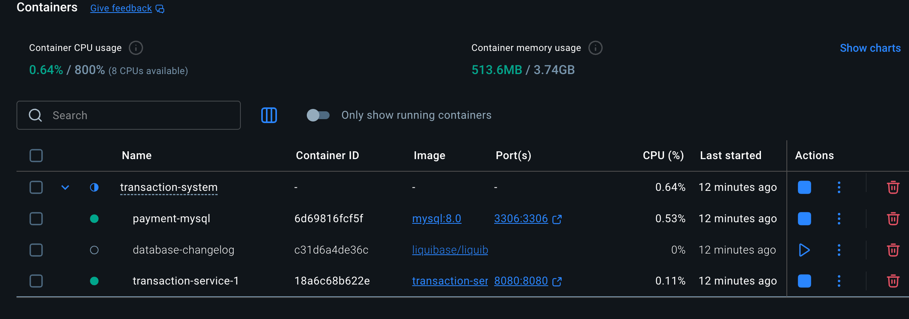

# Purchase and withdrawal management system

This project is to achieve a technical solution to maintain the purchase and withdrawal translation details into a system with REST APIs. Handling high level technical use cases such as  with database and management of database schema versioning and migrations. It includes environment-specific configurations for development and production.
## Features
- **MySQL Database**: Managed via Docker for easy setup and tear down.
- **Liquibase Integration**: For database schema versioning and migrations.
- **Environment-Specific Configurations**: Separate settings for development and production environments.
- **Gradle Build System**: To manage dependencies and build tasks.
- **Automated Deployment Script**: A shell script to streamline the deployment process.
- **Database Change Management**: Easily add and manage database changes using Liquibase changelogs.
- **Docker Compose**: For orchestrating MySQL service in different environments.
- **YAML-based Changelogs**: Use YAML files for defining database changesets.
- **Background Job Execution**: Run Liquibase migrations as background jobs for non-blocking operations.
- **Secure Credential Management**: Recommendations for handling database credentials securely in production.
- **Microservice Architecture**: Designed to be modular and scalable for future enhancements.
- **JOOQ for database management**: JOOQ is used for type-safe SQL query construction and execution.
- **RESTful APIs(Helidon)**: Helidon framework has been used for RESTful API development.

## 1. Quick Setup & Run
   - **Build and deploy Database with One Command**
     - Use the below commands to automated deployment of MySQL (background, only once) and run Liquibase migration (background, also update the changes if new DDL mysql statements needs to execute on the same DB):
     -  Notes Make sure Docker is installed and running on your machine before executing the script.
     - 
       ```sh
       sh ./build-deploy.sh dev   # for development
       sh ./build-deploy.sh prod  # for production
       ```

## 2. Verify the deployment
   - **On successful execution of the script, you should see output similar to below**
   - Container screenshot 
   - Terminal Output:
   ```sh
        WARN[0000] /Users/sumitkumar/Downloads/transaction-service/transaction-system/docker-compose-dev.yml: the attribute `version` is obsolete, it will be ignored, please remove it to avoid potential confusion
        Stopping and removing transaction-service container...
        WARN[0000] /Users/sumitkumar/Downloads/transaction-service/transaction-system/docker-compose-dev.yml: the attribute `version` is obsolete, it will be ignored, please remove it to avoid potential confusion
        [+] Stopping 1/1
        ✔ Container transaction-system-transaction-service-1  Stopped                                                                                                                                             0.7s
        Going to remove transaction-system-transaction-service-1
        [+] Removing 1/1
        ✔ Container transaction-system-transaction-service-1  Removed                                                                                                                                             0.0s
        Running transactional service in background for dev...
        WARN[0000] /Users/sumitkumar/Downloads/transaction-service/transaction-system/docker-compose-dev.yml: the attribute `version` is obsolete, it will be ignored, please remove it to avoid potential confusion
        [+] Running 3/3
        ✔ Container payment-mysql                             Healthy                                                                                                                                             0.8s
        ✔ Container database-changelog                        Running                                                                                                                                             0.0s
        ✔ Container transaction-system-transaction-service-1  Started                                                                                                                                             0.9s
        Transactional service started in the background.
        Deployment completed for dev. For more info check the container logs.
       
   ```

- The script will start MySQL using Docker Compose and apply the Liquibase changelogs to set up the database schema and deploy the microservice below are names of containers started:
     - Mysql : as container name `payment-mysql` 
       - Login credentials are as below (can be changed in docker-compose yaml files as well in application.conf file)
         - Username : devuser (for dev) / paymentuser (for prod)
         - Password : devpass (for dev) / paymentpass (for prod)
     - Liquibase : as container name `database-changelog`
     - Transaction System Microservice : as container name `transaction-service`
   - The script uses environment-specific Docker Compose files and Liquibase properties files to manage configurations.
   

## 3. Add More Database Changes
   - Add new YAML files in `src/main/resources/db/changelog/changes/` and reference them in `changelog-main.yaml`.
   - Rerun the deployment script to apply new changes:
     ```sh
     sh ./build-deploy.sh dev   # for development
     sh ./build-deploy.sh prod  # for production
     ```

## 4. Reset/Clean Up (Only for test purpose not applicable for actual development and production)
   - To remove only containers for testing purpose:
     ```sh
     docker compose -f transaction-system/docker-compose-dev.yml down -v
     # For production environment
     docker compose -f transaction-system/docker-compose.yml down -v
     ```
     Note : This will not delete the database volume also not recommended to change env value once the deployment done (i.e from dev to prod or vice versa) as it may lead to inconsistent state of the database. To do so make sure remove the mysql volume manually for testing purpose.

## 5. Accessing the microservice APIs
   - All the endpoints will be available at `http://localhost:8080/` after successful deployment.
   - Endpoints:
      - `POST /transactions` : To create a purchase transaction
        - request body example:
          ```json
          {
            "account_id" : 1,
            "operation_type_id" : 4,
            "amount": 40.67
           }
          ```
      - `POST /accounts` : To create a account
        - request body example:
          ```json
          {
            "document_number" : "345345345345"  
           }
          ```
      - `GET /accounts/{accountId}` : To get account by accountId

## 6. Access MySQL Database
   - You can access the MySQL database using any MySQL client with the following credentials:
     - Host: `localhost`
     - Port: `3306`
     - Username: `devuser` (for dev) / `paymentuser` (for prod)
     - Password: `devpass` (for dev) / `paymentpass` (for prod)
     - Database: `paymentdb_dev` (for dev) / `paymentdb` (for prod)

## Notes(Not handled but required for actual production use cases)
- This could be divided into multiple microservices for better scalability and maintainability, but due to the limited resource availability, it is kept as a single service.
- MySQL should be started once and kept running in the background along with data recovery and restore points to recover from disasters.
- Liquibase configuration is managed via properties files for each environment.
- To run liquibase ,no manual JDBC driver download is needed; it is handled by Gradle.
- Mysql is installed via docker image, no manual installation needed but in production or actual use case  usually mysql is managed by cloud providers/DBA or IaC tools such as Terraform/cloudformation.
- For production, ensure to load the database credentials securely, e.g., using Docker secrets or cloud secret management solutions i.e AWS secret manager.

## 7. Directory Structure

The following are the main directories in this project:

- `build/` - Contains build outputs, compiled classes, generated sources, distributions, and temporary files created during the build process.
- `gradle/` - Contains Gradle wrapper files for consistent build execution across environments.
- `src/` - Main source directory for the application, including Java source code and resource files.
- `transaction-core/` -  A submodule only containing the API input and output , in real time it can be pushed into organization artifact repository such as Nexus or Artifactory for reusability across multiple projects.
- `transaction-system/` - Contains system-level configuration files, such as Docker Compose files and MySQL initialization scripts.

### Directory Explanations

- **build/**: Stores all files generated by the build process, such as compiled Java classes, packaged JARs, and distribution archives. It is automatically created and updated by Gradle.
- **gradle/**: Holds the Gradle wrapper, which allows anyone to build the project without needing to install Gradle manually. Ensures consistent build tooling.
- **src/**: The main source directory. It contains:
  - `main/java/`: Java source code for the application.
  - `main/resources/`: Configuration files and other resources needed by the application.
- **transaction-core/**: A submodule only containing the API input and output , in real time it can be pushed into organization artifact repository such as Nexus or Artifactory for reusability across multiple projects.
- **transaction-system/**: Contains infrastructure and deployment configuration, such as Docker Compose files for local and production environments, and SQL scripts for initializing the database.
